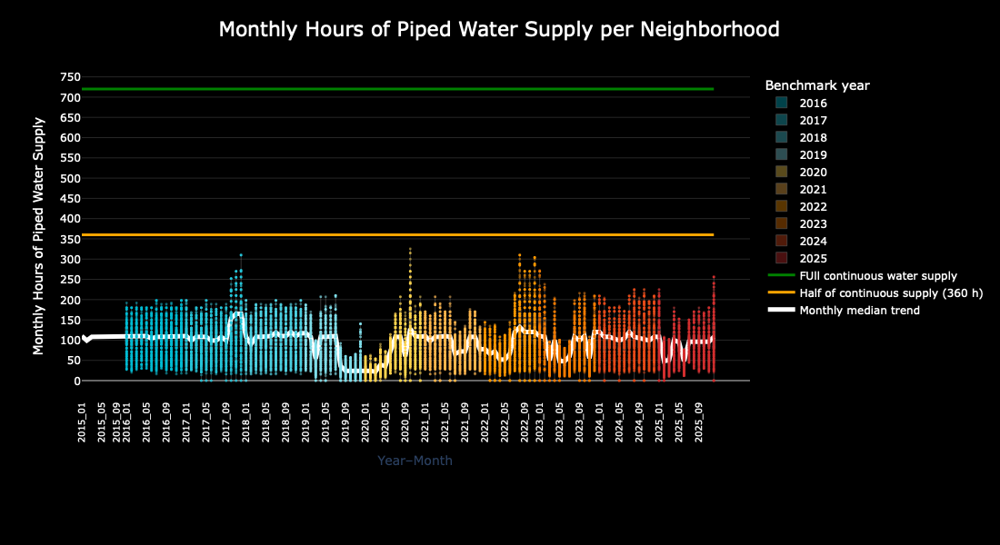
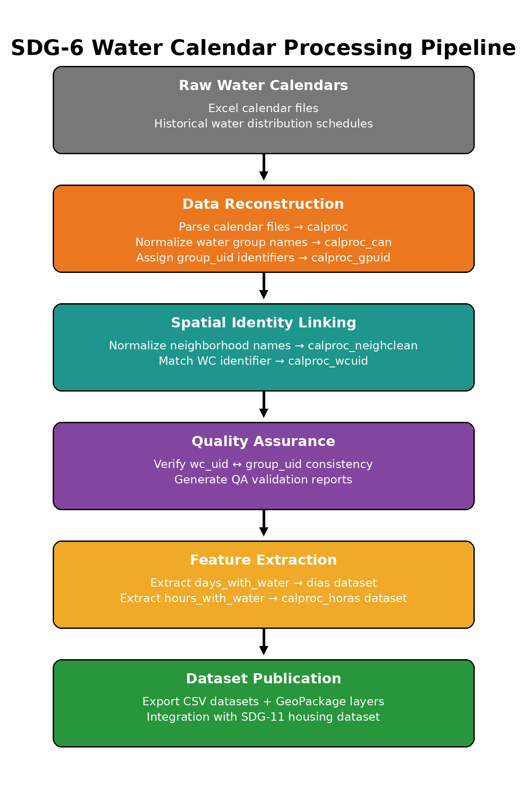

# SDG-6 Historical Water Distribution Calendars – Processing Pipeline

This repository contains the processing pipeline used to reconstruct historical
water distribution calendars for Tegucigalpa, Honduras.

The pipeline extracts structured information from water supply schedules,
computes water availability metrics, performs quality control validation,
and generates standardized outputs for geospatial analysis and longitudinal
urban services research.

This project contributes to monitoring **Sustainable Development Goal 6 (Clean Water and Sanitation)**
by transforming fragmented water distribution calendars into a reproducible dataset
describing water availability patterns across neighborhoods.

Distribution of reconstructed monthly hours of piped water supply per neighborhood.
Each point represents a neighborhood–month observation derived from historical water distribution
calendars. Colors indicate the benchmark year of the calendar source.

The white line shows the **monthly median across neighborhoods**.

Reference lines indicate infrastructure benchmarks:

- **720 hours** – full continuous water supply in a 30-day month  
- **360 hours** – half of continuous supply

The figure illustrates the variability and limited duration of piped water availability
across neighborhoods in the Tegucigalpa water distribution system.

## Data Availability

All datasets generated by this pipeline are archived on **Zenodo** and assigned
a DOI for long-term preservation and citation.

This GitHub repository contains **only the processing pipeline, documentation,
and workflow necessary to reproduce the dataset generation process.**

## Pipeline Overview

The processing workflow includes the following stages:

1. Parsing and normalization of calendar schedule text.
2. Extraction of daily and hourly water availability information.
3. Matching calendar entries to water distribution identifiers (`wc_uid`, `group_uid`).
4. Validation of water sector and water source associations.
5. Generation of QA reports to detect missing or inconsistent identifiers.
6. Aggregation of processed calendar records into standardized datasets.
7. Export of geospatial layers linking water calendars to neighborhood units.

## Pipeline Usage Guide

Detailed instructions for executing the full SDG-6 processing pipeline are provided in the documentation below:

[Pipeline Execution Guide](docs/SDG-6 UsageGuide.md)

This guide explains:

- the ordered pipeline stages
- required configuration parameters
- how to run each processing step using `BatchRunner.py`
- expected outputs and QA reports
## Repository Structure
  
SDG6/
├── README.md
├── docs/
│   └── PIPELINE_USAGE.md
├── scripts/
├── config/
├── data/
├── output/
└── Aggregates/

## Reproducibility

The pipeline is implemented in **Python** and designed to support:

- reproducible data processing
- transparent quality control
- integration with geospatial datasets
- longitudinal analysis of urban water distribution patterns

## Related Dataset

The processed datasets derived from this pipeline are archived on **Zenodo**.

Dataset DOI: *(to be added upon publication)*

The Zenodo archive contains the complete processed datasets and geospatial
outputs generated by this pipeline.

Typical dataset contents include:

- `calendar_hours.csv` — calendar-level water availability (hours)
- `calendar_days.csv` — calendar-level water availability (days)
- `water_distribution_catalog.csv` — mapping of `group_uid` to water sector,
  water source, and distribution unit
- `sdg6_water_calendars.gpkg` — geospatial layer linking water calendars
  to neighborhood units

These datasets support research on urban water distribution,
infrastructure reliability, and SDG-6 monitoring in Tegucigalpa.

## Documentation

Detailed documentation is available in the `docs/` directory:

- `docs/overview.md` — project overview and processing workflow
- `docs/data_model.md` — description of identifiers and dataset structure
- `docs/reproducibility.md` — environment setup and pipeline reproducibility

## License

The code in this repository is released under the **MIT License**.

Datasets archived on Zenodo are released under **CC-BY 4.0**, unless otherwise specified.

The processed datasets derived from this pipeline are archived on Zenodo:

*DOI: (to be added after dataset publication)*

These datasets include structured calendar records, water availability metrics,
and geospatial layers linking water distribution schedules to neighborhoods.
